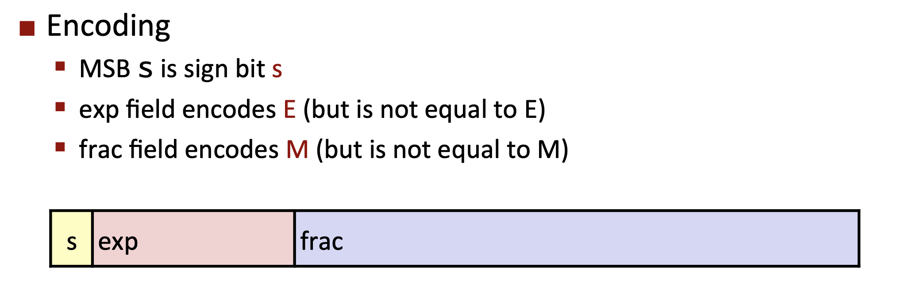
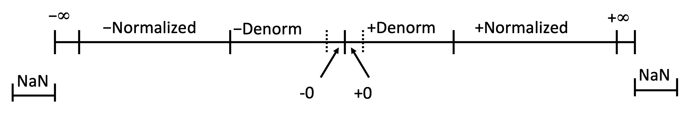

# ICS Notes

$$
\def\vx{\mathbf{x}}
$$

## 02-03-bits-ints

Binary to Unsigned: $\vx \to \sum_{i = 0}^{w - 1} x_i 2^i$.

Binary to Two's Complement: $\vx \to -x_{w - 1}2^{w - 1} + \sum_{i = 0}^{w - 2} x_i 2^i$. （补码）

上面两个 mapping 都是可逆的。

If there is a mix of unsigned and signed in single expression, **signed values implicitly cast to unsigned**.

Expanding ($w$-bit to $(w + k)$-bit): make $k$ copies of sign bit (sign extension).

TAdd/TMult and UAdd/UMult have Identical Bit-Level Behavior.

**Proper way to use unsigned as loop index**:

```c
size_t i; // usize in rust
for (i = cnt - 2; i < cnt; i--)
    a[i] += a[i+1];
```

即使 cnt 是有符号并且 $<0$ 也 work，因为做比较的时候都会转成 unsigned.

**Byte Ordering**: how are the bytes within a mult-byte word ordered in memory.

- Little Endian: x86, ARM processors running Android, iOS, and Windows. Least significant byte has lowest address.

事实上 $\neg x + 1 = -x$ 应该视作 two's complement 的一个性质，而不是补码的定义。

有符号整数的右移可以视为向零取整。

## 04-float

$$
(-1)^s\times M\times 2^E
$$



- Single precision: 1 + 8 + 23 (i. e. `float`)
- Double precision: 1 + 11 + 52 (i. e. `double`)
- Extend precision (Intel only): 1 + 15 + (63 or 64)

**Normalized Values**: $\text{exp} \ne 00\cdots 0, 11\cdots1$.

$E = \text{exp} - \text{bias}$：

- exp: unsigned value of exp field
- bias: $2^{k - 1} - 1$, $k$ for the number of exp bits.
  - Single precision: $-126 \le E \le 127$.
  - Double precision: $-1022 \le E\le 1023$.

$M = 1.(\text{frac})_2$. ($1.0 \le M < 2.0$).

- Indicates that frac field's trailing $0$ doesn't affect the value.

**Denormalized Values**: $\text{exp} = 00\cdots 0$.

- $E = 1 - \text{bias}$.
- $M = 0.(\text{frac})_2$.

$0.0$: $\text{exp} = 00\cdots 0, \text{frac} = 00\cdots 0$. 但是因为符号位没有限制，所以会出现 $+0$ 和 $-0$。

主要用于表示接近于 $0$ 的数。这种表示方式的特点是 equispaced。

**Special Values**: $\text{exp} = 11\cdots 1$.

- $\text{frac} = 00\cdots 0$, the value is $\infty$.
  - $1.0 / 0.0 = +\infty$, $1.0 / -0.0 = -\infty$.
- $\text{frac} \ne 00\cdots 0$, the value is NaN.

Visualization:



并且靠近 $0$ 的地方分布最密集。这么设计还有一个性质就是，假设我们像整型加法一样改变它的二进制表示，那么它的值会以一个相对连续的方式变化（变化的尺度随着与 $0$ 的距离越远而越大）。如果不考虑 NaN 的话，那么也可以用整型的比较方式来比较浮点数。

**Default Rounding**: round to nearest even.

-  When exactly halfway between two possible values, round so that least significant digit is $0$.

inexactness of rounding: 

- `3.14 + 1e10 - 1e10 = 0`.
- `1e20 * 1e20 * 1e-20 = inf`.
- `1e20 * 1e20 - 1e20 * 1e20 = NaN`.